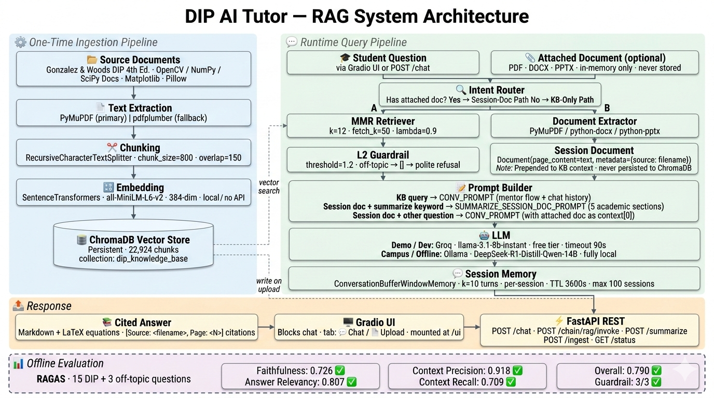

# 🎓 DIP AI Tutor — Smart Learning Assistant

     

A production-ready RAG microservice that acts as an AI tutor exclusively for Digital Image Processing. It grounds every answer in the *Gonzalez & Woods — Digital Image Processing (4th ed.)* textbook and verified library documentation (OpenCV, NumPy, SciPy, Matplotlib, Pillow), delivers rigorous academic citations with every factual claim, and enforces a guardrail that politely rejects off-topic questions. Designed for DIP students who need mathematically precise, cited answers — not a general-purpose chatbot.

The system uses a **dual-LLM strategy**: **Groq `llama-3.1-8b-instant`** (free-tier API, zero billing required) is the primary backend for development and demo. For campus deployment on a private server where a Groq API key is not desirable, set `LLM_BACKEND=ollama` to switch to **DeepSeek-R1-Distill-Qwen-14B** running locally via Ollama — fully offline, zero API cost, no data leaves the institution's network.

---

## Table of Contents

- [Features](#-features)
- [Architecture](#️-architecture)
- [Project Structure](#-project-structure)
- [Quick Start](#-quick-start)
- [API Reference](#-api-reference)
- [Evaluation Results](#-evaluation-results)
- [Configuration](#️-configuration)
- [Roadmap](#-roadmap)
- [Contributing](#-contributing)
- [Author](#-author)
- [License](#license)

---

## ✨ Features

- 📚 **Cited answers** — every factual claim includes `[Source: <file>, Page: <N>]` drawn directly from the knowledge base.

- 🧠 **Multi-turn memory** — per-session `ConversationBufferWindowMemory` (10-turn window) enables follow-up questions without re-stating context.

- 📎 **Session document attach** — attach any PDF, DOCX, or PPTX directly to the chat without ingesting into the KB; the LLM reads your document in full context and answers from it, including structured 5-section academic summaries on demand.

- 📤 **Document upload & ingestion** — upload a new PDF through the Gradio UI or `POST /ingest`; chunks appear in ChromaDB immediately.

- 📑 **Chapter summarization** — map-reduce chain condenses any ingested document into a structured study guide.

- 📝 **Exam question generation** — automatically generates conceptual, mathematical, and applied exam questions from any ingested source.

- 🚫 **Off-topic guardrail** — L2-distance threshold blocks non-DIP queries; 3/3 guardrail tests passed in RAGAS evaluation.

- 🔄 **Dual-LLM backend** — `LLM_BACKEND=groq` (Groq `llama-3.1-8b-instant`, free tier) for development; `LLM_BACKEND=ollama` (DeepSeek-R1-Distill-Qwen-14B, fully local) for campus deployment.

- 📊 **RAGAS-evaluated quality** — 0.790 overall score across 4 metrics on a 15-question DIP test set; all metrics ≥ 0.7.

---

## 🏗️ Architecture



Ingestion: `data/raw/*.pdf` → **PyMuPDF** (primary) / **pdfplumber** (fallback) → `RecursiveCharacterTextSplitter` (chunk_size=800 chars, overlap=150) → **`all-MiniLM-L6-v2`** local embeddings → **ChromaDB** persistent store.

Query: Student question → **MMR Retriever** (k=12, fetch_k=50, λ=0.9) + **L2 guardrail** (threshold=1.2; out-of-domain returns `[]`) → **RAG Prompt** (strict citation + off-topic refusal rules) → **Groq `llama-3.1-8b-instant`** (demo) or **DeepSeek-R1-Distill-Qwen-14B via Ollama** (campus) → cited Markdown answer with LaTeX equations → **Gradio UI** or **FastAPI REST**.

Session-doc attach: User attaches PDF / DOCX / PPTX → PyMuPDF / python-docx / python-pptx text extraction → prepended as context `Document` (never stored in ChromaDB) → LLM called directly, bypassing `ConversationalRetrievalChain`'s condense step → answer from the attached document, not the KB.

---

## 📁 Project Structure

```text
smart-learning-assistant/
├── app/
│   ├── api/
│   │   ├── __init__.py
│   │   └── router.py              # POST /ingest, GET /status, POST /settings/llm_backend, GET /api/info
│   ├── chains/
│   │   ├── __init__.py
│   │   └── rag_chain.py           # LCEL stateless chain + ConversationalRetrievalChain (session store)
│   │                              # + run_chain_with_doc() — session-doc bypass path
│   │                              # + SUMMARIZE_SESSION_DOC_PROMPT — structured 5-section summary
│   ├── ingestion/
│   │   ├── __init__.py
│   │   └── pipeline.py            # PDF extraction (PyMuPDF/pdfplumber), chunking, embedding, ChromaDB
│   ├── retrieval/
│   │   ├── __init__.py
│   │   └── retriever.py           # MMR retriever + L2-distance guardrail (threshold=1.2)
│   ├── summarization/
│   │   ├── __init__.py
│   │   └── summarizer.py          # Map-reduce summary (tenacity retry) + exam question generation
│   ├── evaluation/
│   │   ├── __init__.py
│   │   ├── metrics.py             # Phase A: collect_answers | Phase B: RAGAS scoring
│   │   └── test_questions.json    # 15 DIP + 3 off-topic evaluation questions
│   └── ui/
│       ├── __init__.py
│       ├── favicon.svg            # 🤖 robot SVG favicon (also served inline as base64)
│       └── interface.py           # Gradio Blocks chat + upload UI; session-doc attach panel
├── data/                          # gitignored — not committed
│   ├── chroma_db/                 # Persistent vector store (build via Colab notebook)
│   └── raw/
│       ├── 1_textbooks/           # Gonzalez & Woods DIP 4th ed.
│       ├── 2_core_vision/         # OpenCV, NumPy, SciPy docs
│       └── 3_python_utilities/    # Matplotlib, Pillow docs
├── notebooks/                     # Google Colab only — heavy ingestion & eval
│   ├── ingestion_colab.ipynb      # Run on Colab to build chroma_db/
│   └── evaluation_colab.ipynb     # Run on Colab for RAGAS Phase B scoring
├── scripts/
│   ├── run_ingestion.py           # CLI wrapper for ingestion pipeline
│   ├── smoke_test.py              # Live integration check: starts server, probes all endpoints
│   ├── test_vectorstore.py        # Interactive ChromaDB inspection (prints, not pytest)
│   ├── inspect_chroma.py          # Browse stored chunks interactively
│   └── calibrate_threshold.py     # Tune guardrail L2 threshold
├── tests/                         # pytest-only: all offline, all mocked, no API keys needed
│   ├── __init__.py
│   ├── conftest.py                # Shared fixtures (mock_vectorstore, mock_llm, fake docs)
│   ├── test_ingestion.py          # 11 unit tests — pipeline.py (chunk, embed, metadata)
│   ├── test_rag_components.py     # 11 unit tests — retriever + RAG chain (LCEL, prompts)
│   ├── test_metrics.py            #  7 unit tests — evaluation metrics + report generation
│   └── test_summarizer.py         #  6 unit tests — summarizer + study question generation
├── assets/
│   └── architecture_diagram.png                  # System architecture diagram (referenced in README)
├── .env.example                   # Copy to .env and fill in secrets
├── .gitignore
├── pytest.ini                     # pytest rootdir config (testpaths = tests)
├── validate_setup.py              # Pre-flight environment check (imports, API key, ChromaDB)
├── run_all.py                     # Full health-check / go-no-go checklist
├── DEMO_SCRIPT.md                 # 5-minute timed demo walkthrough
├── evaluation_report.md           # Final RAGAS evaluation report (committed)
├── main.py                        # FastAPI entry point + /manifest.json PWA route
├── Quick Start.bat                # Windows one-click launcher (auto-closes in 10 s)
├── Quick Exit.bat                 # Windows one-click shutdown
└── requirements.txt
```

---

## 🚀 Quick Start

### Prerequisites

- Python **3.10+** (tested on 3.12)
- A [Groq Cloud](https://console.groq.com/keys) API key — free tier, no billing required
- *(Campus/Offline deployment only)* [Ollama](https://ollama.com) with `deepseek-r1` pulled

### Installation

```bash
# 1. Clone the repo
git clone https://github.com/Ziadelshazly22/PixelLab-StudyPal-RAG-DIP.git
cd PixelLab-StudyPal-RAG-DIP/smart-learning-assistant

# 2. Create and activate a virtual environment
# Windows:
py -3 -m venv .venv
.venv\Scripts\activate
# macOS / Linux:
python3 -m venv .venv && source .venv/bin/activate

# 3. Install dependencies
pip install -r requirements.txt

# 4. Configure secrets
copy .env.example .env     # Windows  |  cp .env.example .env  (macOS/Linux)
# Open .env and set GROQ_API_KEY=gsk_...

# 5. Validate your environment (recommended before first run)
python validate_setup.py
```

### Running the Application

> **Windows users:** Double-click **`Quick Start.bat`** — it detects whether the server is already running, starts it if not, and opens the UI automatically.
> To stop all processes cleanly, run **`Quick Exit.bat`**.

For manual control or non-Windows systems:

```bash
# Terminal 1 — FastAPI server
# Wait for "Application startup complete" before opening Terminal 2
uvicorn main:app --reload --port 8000

# Terminal 2 — Gradio UI (optional; also available mounted at /ui inside FastAPI)
python app/ui/interface.py
```

| Endpoint | URL |
| --- | --- |
| API root | `http://localhost:8000/` |
| Swagger docs | `http://localhost:8000/docs` |
| Gradio chat UI | `http://localhost:8000/ui` |

### For Heavy Processing (Ingestion & Evaluation)

Large-scale PDF ingestion and RAGAS evaluation are designed for **Google Colab** where GPU memory and network quota are not bottlenecks:

1. **Ingestion** — open `notebooks/ingestion_colab.ipynb` in Colab, mount your Google Drive, upload the PDFs, run all cells → download `data/chroma_db/` and place it at `smart-learning-assistant/data/chroma_db/`.
2. **Evaluation** — collect answers locally with `python app/evaluation/metrics.py --phase collect`, upload `data/eval_intermediate.json` to Colab, open `notebooks/evaluation_colab.ipynb`, run all cells → download `evaluation_report.md`.

> `.py` equivalents in `scripts/` and `app/evaluation/metrics.py` are available for teams with access to a strong local or campus server.

---

## 📡 API Reference

| Endpoint | Method | Description | Request Body | Response |
| --- | --- | --- | --- | --- |
| `/` | GET | Root status + nav links | — | `{"message": str, "docs": str, "ui": str}` |
| `/health` | GET | Liveness probe (Docker/load-balancer) | — | `{"status": "ok"}` |
| `/api/health` | GET | Auxiliary liveness probe | — | `{"status": "ok"}` |
| `/api/info` | GET | Service version + active models | — | `{"version": str, "llm_backend": str, ...}` |
| `/chain/rag/invoke` | POST | Stateless one-shot RAG query | `{"input": "<question>"}` | `{"output": "<answer>"}` |
| `/chat` | POST | Stateful multi-turn chat (session memory) | `{"question": str, "session_id": str, "doc_context": str (opt), "doc_filename": str (opt)}` | `{"answer": str, "session_id": str, "sources": list}` |
| `/chat/{session_id}` | DELETE | Clear session memory buffer | — | `{"status": "cleared"\|"not_found"}` |
| `/ingest` | POST | Upload and ingest a PDF into ChromaDB | `multipart/form-data: file=<pdf>` | `{"chunks_added": int, "source": str}` |
| `/status` | GET | Knowledge-base stats (chunk count, sources) | — | `{"collection": str, "chunks": int, ...}` |
| `/settings/llm_backend` | POST | Switch LLM backend at runtime | `{"backend": "groq"\|"ollama"}` | `{"active_backend": str}` |
| `/summarize` | POST | Map-reduce summary + study questions | `{"source": str, "include_questions": bool, "n_questions": int}` | `{"summary": str, "study_questions": list}` |
| `/manifest.json` | GET | PWA Web App Manifest (suppresses browser 404 noise) | — | JSON manifest |
| `/favicon.ico` | GET | Browser tab favicon (🤖 SVG) | — | SVG |
| `/docs` | GET | Interactive Swagger UI | — | HTML |

---

## 📊 Evaluation Results

Evaluated with **RAGAS** on 15 DIP questions + 3 off-topic guardrail checks, using **Groq `llama-3.1-8b-instant`** as judge LLM.

| Metric | Score | Target | Status |
| --- | --- | --- | --- |
| Faithfulness | 0.726 | ≥ 0.700 | ✅ PASS |
| Answer Relevancy | 0.807 | ≥ 0.700 | ✅ PASS |
| Context Precision | 0.918 | ≥ 0.700 | ✅ PASS |
| Context Recall | 0.709 | ≥ 0.700 | ✅ PASS |
| **Overall (mean)** | **0.790** | **≥ 0.700** | **✅ PASS** |
| Guardrail (3 off-topic) | 3 / 3 | 3 / 3 | ✅ PASS |
| Mean Response Latency | 23.78 s | < 5.0 s | ⚠️ Over target* |

> \*Latency is dominated by Groq's free-tier rate-limiter (`EVAL_REQUEST_DELAY=15 s`), not actual LLM inference time. Switching to Ollama on a local server eliminates API throttling.

To reproduce: `python app/evaluation/metrics.py --phase collect` (local), then `notebooks/evaluation_colab.ipynb` (Colab).
Full per-topic breakdown: [`evaluation_report.md`](smart-learning-assistant/evaluation_report.md).

---

## ⚙️ Configuration

All settings are loaded from `.env` (copy from `.env.example`):

| Variable | Default | Description |
| --- | --- | --- |
| `LLM_BACKEND` | `groq` | Active LLM backend: `groq` (demo/dev) or `ollama` (campus/offline) |
| `GROQ_API_KEY` | *(required for groq)* | Groq API key — [console.groq.com/keys](https://console.groq.com/keys) |
| `LLM_MODEL` | `llama-3.1-8b-instant` | Groq model name (used when `LLM_BACKEND=groq`) |
| `EMBEDDING_MODEL` | `all-MiniLM-L6-v2` | SentenceTransformers model for local embeddings (no API key needed) |
| `CHROMA_PERSIST_DIR` | `./data/chroma_db` | Path to the persistent ChromaDB vector store |
| `OLLAMA_BASE_URL` | `http://localhost:11434` | Ollama server URL (used when `LLM_BACKEND=ollama`) |
| `DEEPSEEK_MODEL` | `deepseek-r1` | Ollama model name for campus deployment |
| `API_HOST` | `0.0.0.0` | FastAPI bind address |
| `API_PORT` | `8000` | FastAPI port |
| `LOG_LEVEL` | `INFO` | Python logging level (`DEBUG`, `INFO`, `WARNING`) |

---

## 🔮 Roadmap

- 🧮 **Nougat OCR** — pipe scanned textbook pages through `nougat-ocr` before chunking to preserve LaTeX equations as structured text rather than raw image pixels
- 🖼️ **Image-aware multimodal RAG** — extend the pipeline to index and retrieve diagram images (edge detection examples, frequency spectra) alongside text chunks
- 👤 **Student progress tracking** — per-student session analytics, topic coverage heatmap, concept-mastery scoring
- 🎓 **Automated quiz generation with grading** — generate and auto-grade multiple-choice and fill-in-the-blank assessments; export results to a gradebook
- 🌐 **React frontend** — replace the Gradio demo UI with a full-featured React SPA for integration into the [PixelLab Learning Platform](https://github.com/Ziadelshazly22/PixelLab)

---

## 🤝 Contributing

Pull requests are welcome. Key conventions:

- **Colab notebooks** (`notebooks/`) are authoritative for heavy GPU/quota tasks (ingestion, RAGAS scoring)

- **Local `.py` files** are authoritative for all other development

- **`tests/`** — pytest only, all offline, all mocked (`def test_*` functions with fixtures from `conftest.py`)

- **`scripts/`** — CLI and inspection tools (no pytest collection, may require live server or ChromaDB)

- Never commit `.env`, `data/chroma_db/`, or `data/raw/` — all gitignored at repo root

---

## 👤 Author

**Ziad Mahmoud ElShazly** — [ziad.m.elshazly@gmail.com](mailto:ziad.m.elshazly@gmail.com)

---

## License

See [LICENSE](../LICENSE).
